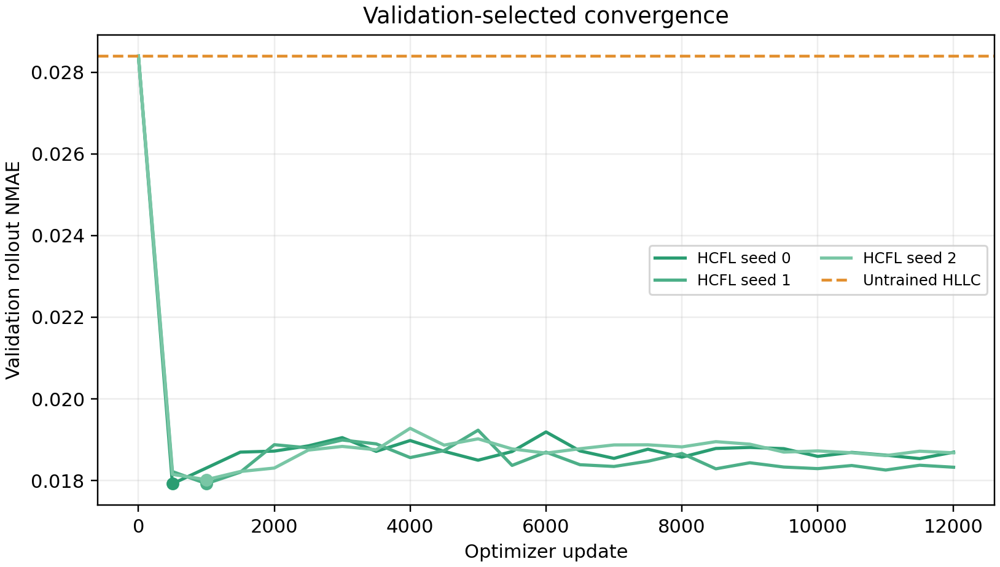
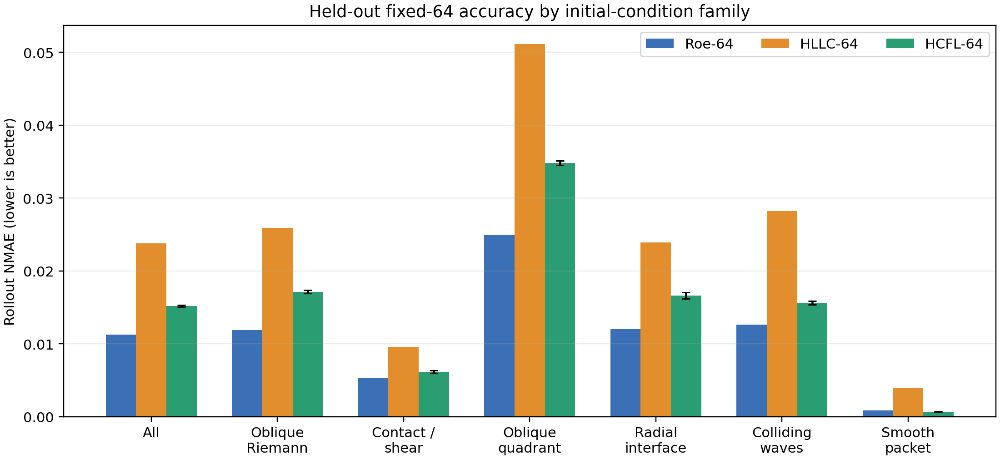
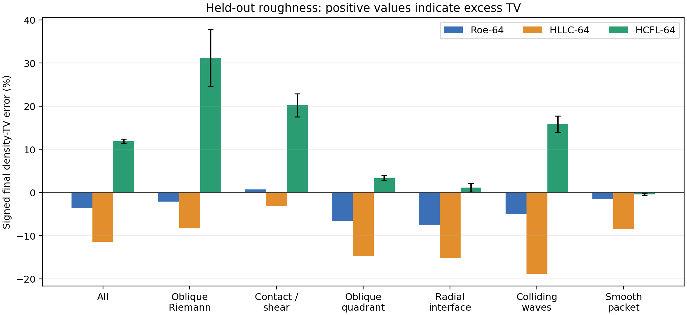

# Diverse fixed-64 2-D Euler HCFL results

## Bottom line

Training the frozen 18-cell HCFL model on a substantially larger and more
diverse high-resolution Euler dataset is useful, but it does not yet beat the
strong Roe-64 comparator.

- On 36 previously unread test trajectories, HCFL-64 has mean NMAE
  `0.01518 +/- 0.00012` across three seed means.
- This is a **36.2% reduction** from HLLC-64 (`0.02379`) and HCFL wins on
  35 of 36 paired test cases.
- PyClaw Roe-64 remains better at `0.01128`; HCFL is 34.5% higher and wins
  only 8 of 36 paired cases.
- HCFL has positive mean density-TV excess (`13.0%`), especially on oblique
  Riemann, contact/shear, and colliding-wave cases.  The new model is more
  accurate than HLLC but is not uniformly non-oscillatory.
- All 108 HCFL seed-trajectories complete with positive density and pressure,
  conservative updates, the hard interface projection, and a non-positive
  fully discrete entropy balance.

The supported claim is therefore a fixed-grid learned-closure result:
high-resolution supervision lets the constrained learned flux recover a large
part of the error of HLLC-64.  This experiment does not support superiority to
Roe-64 or a cross-grid generalization claim.

## Data and reference

Every learned and coarse method runs at `64 x 64`.  The reference trajectories
are generated with classic PyClaw 5.10, the four-wave 2-D Euler Roe solver,
`transverse_waves=2`, and a `512 x 512` mesh.  Fine-cell conserved variables
`(rho, rho*u, rho*v, E)` are block averaged to `64 x 64`; primitive variables
are never averaged.

The dataset contains:

| split | trajectories | per family | seed |
|---|---:|---:|---:|
| train | 192 | 32 | 86001 |
| validation | 36 | 6 | 87001 |
| held-out test | 36 | 6 | 88001 |

The six balanced families are oblique Riemann problems, contact/shear waves,
oblique quadrants, radial interfaces, colliding waves, and smooth wave packets.
The serialized initial-condition parameters are exactly disjoint between all
three splits.  Every trajectory covers `t=0` through `t=0.1` at saved intervals
of `0.005`.

A one-case-per-family reference audit gives:

| restricted comparison | rollout NMAE | final NMAE |
|---|---:|---:|
| `256 -> 64` versus `1024 -> 64` | 0.003586 | 0.004890 |
| `512 -> 64` versus `1024 -> 64` | **0.001234** | **0.001696** |

The `512` reference error is well below the model errors measured here.  It is
treated as a converged-enough numerical reference, not an exact solution.

## Validation convergence

The architecture is unchanged from the selected `flat18` transverse model:
10,804 parameters, an oriented `3 x 6` face patch, HLLC base flux, signed
Roe-wave correction, hard Tadmor projection, and proposal-feasibility loss.
The HLL endpoint is excluded from the training forward pass.

| seed | best update | best validation NMAE | stop update | stop reason |
|---:|---:|---:|---:|---|
| 0 | 500 | 0.017921 | 12,000 | minimum-LR validation plateau |
| 1 | 1,000 | 0.017924 | 12,000 | minimum-LR validation plateau |
| 2 | 1,000 | 0.018022 | 12,000 | minimum-LR validation plateau |

All runs continued through learning rates `5e-4`, `1e-4`, and `2e-5`.  Later
weights did not improve validation NMAE, so the selected checkpoints are early
checkpoints rather than the final optimizer states.  No run was stopped by
inspection or by the 50,000-update cap.

## Held-out accuracy

The test archive was read once, after every seed had stopped.  Native Roe-64
and HLLC-64 start from exactly the same restricted `512 -> 64` initial state as
HCFL-64.

| method | rollout NMAE | NRMSE | positive density-TV excess | signed density-TV error | completion |
|---|---:|---:|---:|---:|---:|
| PyClaw Roe-64 | **0.01128** | **0.03761** | 0.44% | -3.64% | 36 / 36 |
| HLLC-64 | 0.02379 | 0.06780 | **0.11%** | -11.43% | 36 / 36 |
| HCFL-64, 3-seed mean | 0.01518 +/- 0.00012 | 0.04683 | 13.04% | +11.89% | 108 / 108 |

Per-seed HCFL NMAEs are `0.01502`, `0.01520`, and `0.01532`.  Thus the gain over
HLLC is seed-robust.  A paired case bootstrap for `HCFL - HLLC` gives a mean
difference of `-0.00861` and a 95% interval `[-0.01050, -0.00680]`.  For
`HCFL - Roe`, the mean difference is `+0.00390` with interval
`[+0.00263, +0.00528]`.

### Accuracy by family

| family | Roe-64 NMAE | HLLC-64 NMAE | HCFL-64 NMAE | HCFL gain over HLLC | HCFL positive TV excess |
|---|---:|---:|---:|---:|---:|
| oblique Riemann | **0.01191** | 0.02592 | 0.01716 | 33.8% | 33.39% |
| contact / shear | **0.00537** | 0.00956 | 0.00617 | 35.4% | 20.22% |
| oblique quadrant | **0.02493** | 0.05117 | 0.03480 | 32.0% | 4.56% |
| radial interface | **0.01201** | 0.02390 | 0.01664 | 30.4% | 3.24% |
| colliding waves | **0.01264** | 0.02820 | 0.01560 | 44.7% | 16.78% |
| smooth packet | 0.000838 | 0.003986 | **0.000705** | 82.3% | 0.07% |

HCFL improves HLLC in every family and slightly beats Roe-64 on the smooth
packet family.  The discontinuous families show the central remaining issue:
the accuracy gain is real, but excess TV indicates under-dissipated local
corrections.

## Physical and numerical audit

Across all three HCFL test rollouts:

| check | result |
|---|---:|
| completed trajectories | 108 / 108 |
| minimum density | 0.15724 |
| minimum pressure | 0.08505 |
| maximum hard-interface residual | 4.55e-7 |
| maximum relative conservation closure | 3.33e-9 |
| maximum fully discrete entropy balance | -9.89e-6 |
| positivity safety activations | 0 |
| entropy safety activations | 1 / 8,784 batch-substeps |
| minimum safety blend beta | 0.94779 |

The one entropy-safety activation occurs only for seed 1, corresponding to a
rate of `0.0114%`.  Seeds 0 and 2 use no deployment fallback.  It is therefore
incorrect to describe all predictions as entirely fallback-free, but they are
also not HLL solutions in disguise.

## The network did not converge to zero correction

On held-out states:

| seed | mean absolute Roe coefficient | coefficient fraction above `1e-3` | transverse response | correction / HLLC flux L1 |
|---:|---:|---:|---:|---:|
| 0 | 0.786 | 99.9988% | 0.842% | 0.695% |
| 1 | 0.826 | 99.9976% | 1.117% | 0.709% |
| 2 | 0.812 | 99.9982% | 1.023% | 0.713% |

The learned correction is small relative to the full physical flux, as a
numerical correction should be, but it is decisively nonzero and depends on
the transverse rows.

## Interpretation

The expanded data changes the scientific conclusion in a useful way:

1. The model can learn a reproducible coarse-grid correction from diverse
   solutions of the same Euler equations rather than memorizing one quadrant
   template.
2. High-resolution supervision contains enough information to improve a
   `64 x 64` constrained rollout substantially over its HLLC base.
3. Roe-64 remains the stronger general discontinuity solver.  The next model
   change should target shock-sensitive dissipation or an oscillation-aware
   training term, not simply add more updates to the present training run.
4. The smooth-packet result shows that the correction can exceed Roe-64 where
   excess dissipation dominates; the discontinuous cases show where stronger
   upwinding or a local TV/shock sensor is still needed.

The executable result audit is in `results/AUDIT.json`; all required checks
pass, with the single entropy-safety activation explicitly retained.
