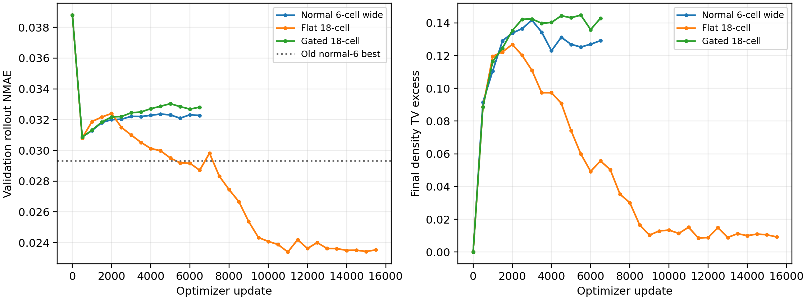
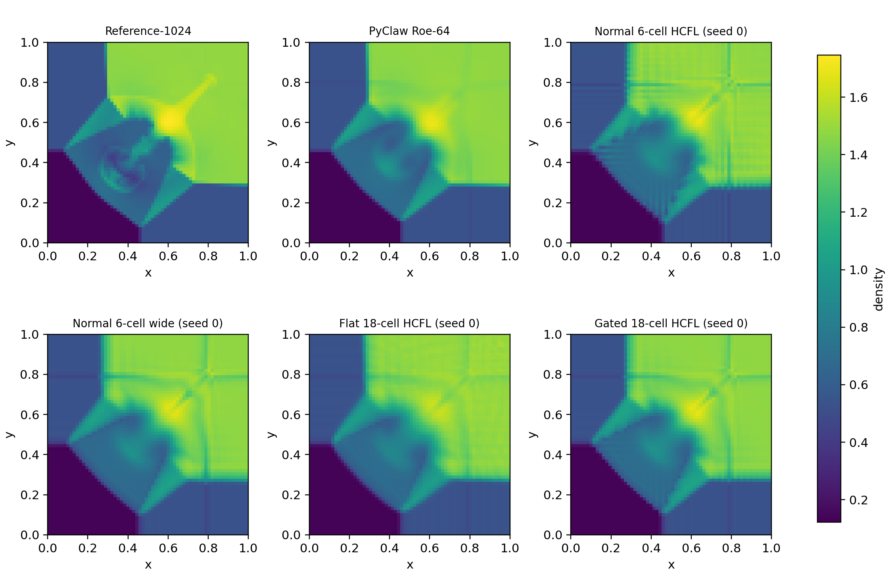
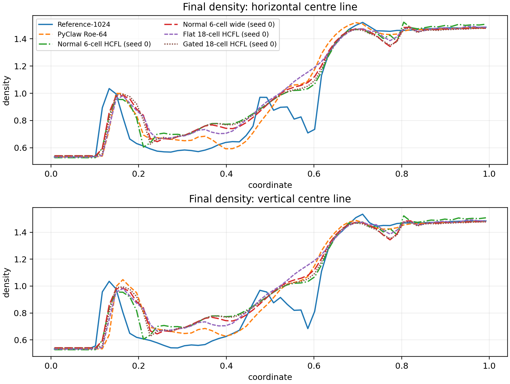

# 2-D Euler transverse-stencil ablation results

## Bottom line

The direct `3 x 6` patch model (`flat18`) is the only tested architecture that
benefits materially from transverse information.  It improves held-out ID
accuracy and substantially reduces density-TV excess relative to the original
normal-only HCFL.  An exactly parameter-matched normal-only control rules out
network size as the explanation.

The result is not a complete solution:

- PyClaw Roe-64 remains much more accurate.
- Improvement is seed-sensitive.
- On the already-observed long official quadrant case, mean NMAE is essentially
  unchanged and slightly worse than the original HCFL, although mean TV excess
  is lower.
- Lower curvature shows that part of the TV reduction is additional smoothing,
  not only removal of oscillations.

Accordingly, the supported conclusion is that true transverse context is useful
and the normal-only architecture was a real limitation.  The experiment does
not support a claim that the 2-D method is now competitive with PyClaw Roe or
that long-horizon OOD oscillations have been eliminated uniformly.

## Controlled design

All models retain the same HLLC base flux, signed four-wave normal Roe
correction, hard Tadmor projection, proposal-feasibility loss, conservative
shared face flux, and HLL deployment safety endpoint.  Only the coefficient
network changes.

| model | face input | parameters | purpose |
|---|---:|---:|---|
| original normal-6 | `1 x 6` cells | 7,348 | previous baseline |
| normal6wide | `1 x 6` cells | 10,804 | capacity control |
| flat18 | `3 x 6` cells | 10,804 | unstructured joint learning |
| gated18 | `3 x 6` cells | 10,872 | exact 1-D-reduction proposal |

`normal6wide` and `flat18` have exactly equal parameter counts.  The capacity
control was added after seed-zero flat training began but before any new ID or
official evaluation.  This amendment is recorded in `protocol.json`.

The controlled ablation reuses the frozen 48-trajectory training set and
12-trajectory validation set.  Model selection is completion followed by
validation NMAE.  The 50,000-update cap, validation interval, learning-rate
schedule, plateau rule, minibatch size, and six internal substeps are unchanged.

## Validation and convergence

| architecture | seeds | best update(s) | validation NMAE |
|---|---:|---|---:|
| original normal-6 | 3 | 500 / 500 / 500 | 0.030038 +/- 0.000543 |
| normal6wide | 1 | 500 | 0.030866 |
| gated18 | 1 | 500 | 0.030852 |
| flat18 | 3 | 11,000 / 10,000 / 500 | **0.027442 +/- 0.002868** |

Flat18 lowers mean validation NMAE by 8.64% relative to the original model, but
its between-seed standard deviation is much larger.  Seed zero reaches a strong
late-training basin (`0.023391`), seed one reaches `0.029295`, and seed two
stops at `0.029640`.  All runs were allowed to reach the fixed
minimum-learning-rate plateau criterion; no run was manually truncated.

The gated design does not work in its present form.  Its mean normalized
transverse sensor is only about `0.0248`, so the residual branch is strongly
attenuated.  More importantly, it fails even though its coefficient response
to transverse context is similar in magnitude to some flat18 seeds.  The
learned joint dependence, not merely the amount of transverse response, is
therefore important.

## Held-out ID result

Flat18 is the mean over three seeds; `+/-` denotes the standard deviation of
the three per-seed means.  The two new controls are seed-zero diagnostics.

| method | NMAE | NRMSE | density TV excess |
|---|---:|---:|---:|
| PyClaw Roe-64 | **0.01663** | **0.05262** | 0.00% |
| HLLC-64 | 0.03778 | 0.10027 | 0.00% |
| original normal-6 HCFL | 0.02824 +/- 0.00038 | 0.08054 | 9.09% |
| normal6wide (seed 0) | 0.02915 | 0.08357 | 7.23% |
| gated18 (seed 0) | 0.02914 | 0.08318 | 6.48% |
| flat18 | **0.02728 +/- 0.00194** | 0.07944 +/- 0.00551 | **4.60% +/- 2.36%** |

Relative to the original HCFL, flat18 improves ID NMAE by 3.39% and reduces
mean positive TV excess by 49.36%.  Relative to the exactly parameter-matched
normal6wide control, its NMAE is 6.43% lower.  Thus the improvement cannot be
explained by parameter count alone.

The signed ID density-TV error is `+2.02% +/- 3.61%`, while the signed density
second-difference/curvature error is `-24.47% +/- 2.12%`.  The latter is an
important caveat: the model is smoother than the restricted reference under
this roughness measure.  Reduced positive TV is therefore partly genuine
oscillation suppression and partly numerical diffusion.

Per-seed ID NMAEs are `0.02454`, `0.02878`, and `0.02852`; the architecture is
not relying solely on one failed trajectory or on excluding failures.

## Long official quadrant diagnostic

This public case was observed before the ablation and is strictly post-hoc.  It
was never used for checkpoint or architecture selection.

| method | NMAE | NRMSE | density TV excess |
|---|---:|---:|---:|
| PyClaw Roe-64 | **0.07628** | **0.30668** | 0.00% |
| HLLC-64 | 0.11742 | 0.39363 | 0.00% |
| original normal-6 HCFL | 0.10814 +/- 0.00689 | 0.36021 | 14.93% |
| flat18 | 0.10879 +/- 0.00604 | 0.33637 +/- 0.01702 | 8.74% +/- 11.24% |

Mean NMAE is 0.59% worse than the original HCFL, so this is not a long-OOD
accuracy win.  Mean positive TV excess is 41.47% lower, but this average hides
large seed variation: the three values are `0.00%`, `24.61%`, and `1.61%`.
Seed-zero flat18 has NMAE `0.10045` and no positive TV excess, whereas seed one
still oscillates strongly.  The signed mean curvature error is `-17.12%`, again
showing an accuracy/smoothing tradeoff.

The following figures show seed zero for every HCFL model and label that fact;
tables and claims use all three flat18 seeds.

## Physical and numerical audit

Across all 39 flat18 evaluation trajectories (36 ID seed-trajectories plus
three official seed-trajectories):

| check | result |
|---|---:|
| completion | 39 / 39 |
| minimum density | 0.11147 |
| minimum pressure | 0.02140 |
| maximum hard interface residual | 4.89e-8 |
| maximum relative conservation closure | 7.63e-9 |
| positivity safety activations | 0 |
| entropy safety activations | 0 |
| largest fully-discrete entropy balance | negative |

Thus the reported flat18 predictions are conservative, positive and
entropy-admissible under the same audit, and are not secretly HLL fallback
solutions.

## Interpretation and next experiment

Supported by this ablation:

- the old normal-only stencil was a genuine architectural limitation;
- a direct shared `3 x 6` patch can learn useful transverse dependence;
- the improvement is not caused only by a larger network;
- hard projection and conservative face sharing remain compatible with wider
  two-dimensional context.

Not supported:

- superiority to PyClaw Roe-64;
- a uniform long-horizon OOD improvement;
- seed-robust removal of grid-aligned oscillations;
- superiority of the proposed gated residual architecture.

The next confirmatory experiment should freeze flat18 before generating a new
validation/test family containing rotated discontinuities and oblique
shock-contact interactions.  It should not tune on the official quadrant.
Optimization robustness also needs attention, since transverse coefficient
response varies from roughly 0.43% to 0.93% across selected seeds and strongly
correlates with the achieved basin.
